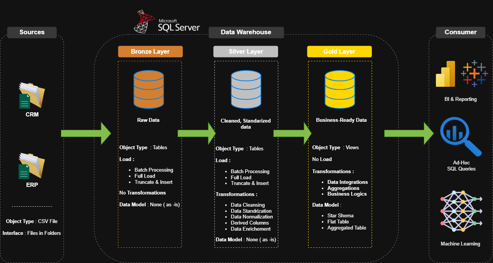
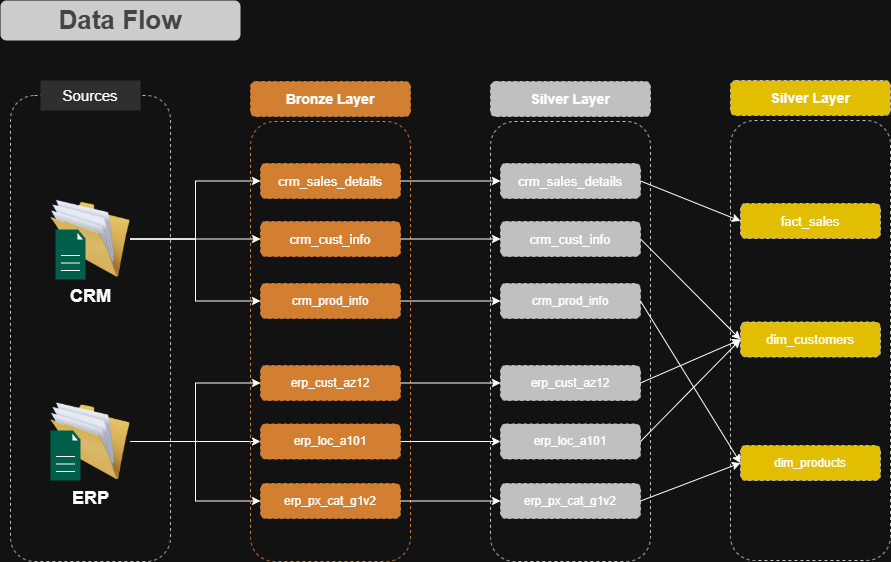
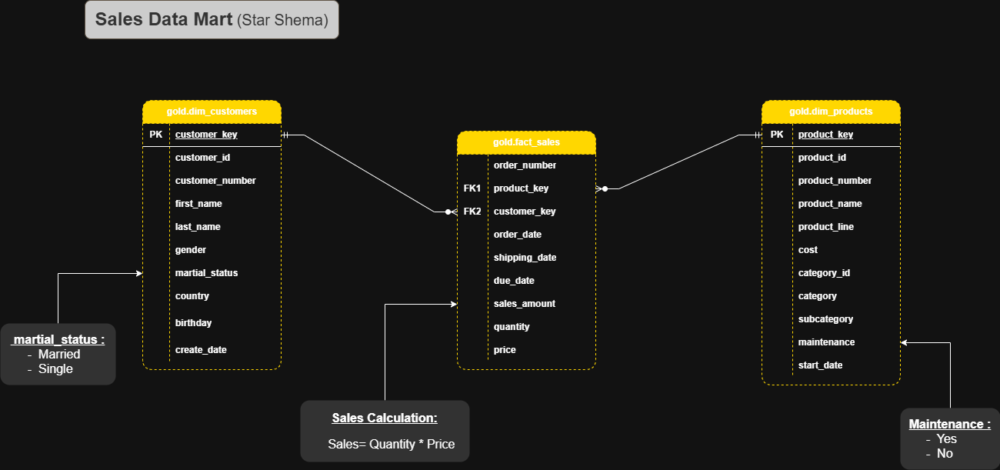
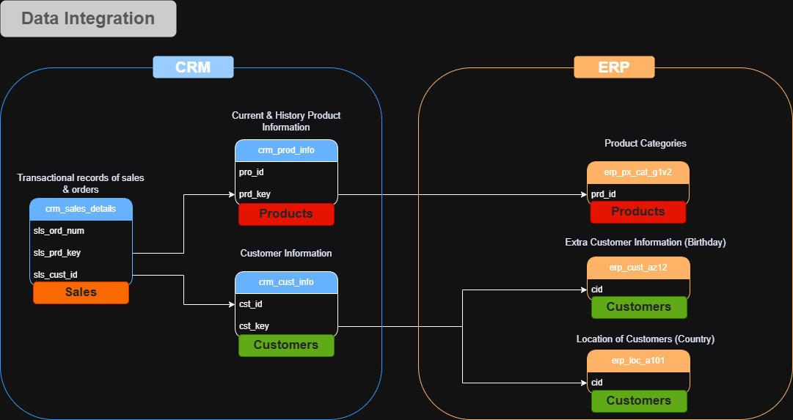

# 🏢 Sales Data Warehouse - SQL Server Implementation

A production-ready **SQL Server data warehouse** implementing the **Medallion Architecture** (Bronze → Silver → Gold) with a star schema design for sales analytics. Integrates data from **CRM** and **ERP** systems to provide business-ready insights.



---

## 📋 Table of Contents

- [🏢 Sales Data Warehouse - SQL Server Implementation](#-sales-data-warehouse---sql-server-implementation)
  - [📋 Table of Contents](#-table-of-contents)
  - [🎯 Project Overview](#-project-overview)
  - [📋 Project Requirements](#-project-requirements)
    - [Building the Data Warehouse (Data Engineering)](#building-the-data-warehouse-data-engineering)
    - [BI: Analytics \& Reporting (Data Analysis)](#bi-analytics--reporting-data-analysis)
  - [🏗️ Architecture](#️-architecture)
    - [Medallion Architecture Layers](#medallion-architecture-layers)
    - [Data Flow](#data-flow)
  - [📊 Data Model](#-data-model)
    - [Star Schema Design](#star-schema-design)
    - [Entity Relationships](#entity-relationships)
  - [📁 Project Structure](#-project-structure)
  - [🚀 Getting Started](#-getting-started)
    - [Prerequisites](#prerequisites)
    - [Installation](#installation)
  - [💾 Data Sources](#-data-sources)
    - [CRM System](#crm-system)
    - [ERP System](#erp-system)
  - [🔄 ETL Pipeline](#-etl-pipeline)
    - [Bronze Layer (Raw Data Ingestion)](#bronze-layer-raw-data-ingestion)
    - [Silver Layer (Data Cleansing \& Transformation)](#silver-layer-data-cleansing--transformation)
    - [Gold Layer (Business-Ready Analytics)](#gold-layer-business-ready-analytics)
  - [✅ Quality Checks](#-quality-checks)
  - [📖 Documentation](#-documentation)
  - [🔑 Key Features](#-key-features)
  - [🛠️ Technology Stack](#️-technology-stack)
  - [🙏 Acknowledgments](#-acknowledgments)
    - [Learning Resources:](#learning-resources)
  - [📄 License](#-license)
  - [👤 Author](#-author)

---

## 🎯 Project Overview

This data warehouse consolidates sales, customer, and product data from disparate CRM and ERP systems into a unified analytics platform. The implementation follows **data engineering best practices** with:

- **Medallion Architecture** for progressive data refinement
- **Star Schema** for optimized analytical queries
- **Idempotent Scripts** for safe re-execution
- **Comprehensive Quality Checks** for data integrity
- **Master Data Management** with source prioritization
- **Surrogate Keys** for dimension table management

**Business Value:**

- Unified view of customers across CRM and ERP systems
- Product catalog with category hierarchies
- Sales transaction history with dimensional context
- Foundation for BI dashboards and reporting

---

## 📋 Project Requirements

### Building the Data Warehouse (Data Engineering)

**Objective:**  
Develop a modern data warehouse using SQL Server to consolidate sales data, enabling analytical reporting and informed decision-making.

**Specifications:**

- **Data Sources**: Import data from two source systems (ERP and CRM) provided as CSV files
- **Data Quality**: Cleanse and resolve data quality issues prior to analysis
- **Integration**: Combine both sources into a single, user-friendly data model designed for analytical queries
- **Scope**: Focus on the latest dataset only; historization of data is not required
- **Documentation**: Provide clear documentation of the data model to support both business stakeholders and analytics teams

### BI: Analytics & Reporting (Data Analysis)

**Objective:**  
Develop SQL-based analytics to deliver detailed insights into:

- **Customer Behavior**
- **Product Performance**
- **Sales Trends**

These insights empower stakeholders with key business metrics, enabling strategic decision-making.

📌 **Detailed Project Plan**: [View Full Project Roadmap on Notion](https://believed-anger-bb4.notion.site/SQL-Data-Warehouse-Project-2cca48f564c380dabafadc9b4c27d0b1?pvs=73)

The project plan includes:

- ✅ Requirements Analysis
- ✅ Design Data Architecture
- ✅ Project Initialization
- ✅ Build Bronze Layer
- ✅ Build Silver Layer
- ✅ Build Gold Layer
- ✅ Analytics & Reporting
- ✅ Documentation & Testing

---

## 🏗️ Architecture

### Medallion Architecture Layers

The data warehouse is organized into three progressive refinement layers:

| Layer         | Purpose                  | Data Quality          | Objects             | Load Pattern                          |
| ------------- | ------------------------ | --------------------- | ------------------- | ------------------------------------- |
| **🟧 Bronze** | Raw data ingestion       | As-is from source     | Tables              | BULK INSERT (CSV → SQL)               |
| **🔷 Silver** | Cleaned & standardized   | Validated, normalized | Tables              | Batch processing with transformations |
| **🟨 Gold**   | Business-ready analytics | Enriched, integrated  | Views (Star Schema) | No load - virtual layer               |


### Data Flow



---

## 📊 Data Model

### Star Schema Design

The Gold layer implements a **star schema** with:

- **2 Dimension Tables**: `dim_customers`, `dim_products`
- **1 Fact Table**: `fact_sales`



### Entity Relationships



---

## 📁 Project Structure

```
SQL-DATA-WAREHOUSE/
├── 📂 datasets/
│   ├── source_crm/          # CRM system CSV exports
│   │   ├── cust_info.csv
│   │   ├── prd_info.csv
│   │   └── sales_details.csv
│   └── source_erp/          # ERP system CSV exports
│       ├── cust_az12.csv    # Customer demographics
│       ├── loc_a101.csv     # Customer locations
│       └── px_cat_g1v2.csv  # Product categories
│
├── 📂 docs/
│   ├── data_architecture.png    # Medallion architecture diagram
│   ├── data_catalog.md          # Gold layer data dictionary
│   ├── data_flow.png            # Source-to-consumption lineage
│   ├── data_integration.png     # Cross-system relationships
│   ├── data_model.png           # Star schema ERD
│   └── naming_conventions.md    # Naming standards
│
├── 📂 scripts/
│   ├── 01-bronze/
│   │   ├── ddl_bronze.sql           # Bronze table definitions
│   │   └── SQL_load_script.sql      # Bronze load stored procedure
│   ├── 02-silver/
│   │   ├── ddl_silver.sql           # Silver table definitions
│   │   └── proc_load_silver.sql     # Silver ETL stored procedure
│   └── 03-gold/
│       ├── init_database.sql        # Database & schema creation
│       └── ddl_gold.sql             # Gold view definitions
│
├── 📂 tests/
│   ├── quality_checks_silver.sql    # Silver layer validation
│   └── quality_checks_gold.sql      # Gold layer validation
│
└── 📄 README.md
```

---

## 🚀 Getting Started

### Prerequisites

- **SQL Server 2017+** (or SQL Server Express)
- **SQL Server Management Studio (SSMS)** or Azure Data Studio
- File system access for CSV data sources
- Permissions to create databases and bulk insert

### Installation

**1. Clone the repository**

```bash
git clone https://github.com/yourusername/sql-data-warehouse.git
cd sql-data-warehouse
```

**2. Update file paths**

Edit `scripts/01-bronze/SQL_load_script.sql` and update the file paths to match your local environment:

```sql
-- Example: Update this path
FROM 'C:\Users\hp\Documents\ENSET\Big Data\Projects\SQL Data Warehouse\datasets\source_crm\cust_info.csv'
-- To your actual path
FROM 'C:\YourPath\sql-data-warehouse\datasets\source_crm\cust_info.csv'
```

**3. Create database and schemas**

```sql
:r scripts/03-gold/init_database.sql
```

**4. Create Bronze layer**

```sql
:r scripts/01-bronze/ddl_bronze.sql
:r scripts/01-bronze/SQL_load_script.sql
```

**5. Create Silver layer**

```sql
:r scripts/02-silver/ddl_silver.sql
:r scripts/02-silver/proc_load_silver.sql
```

**6. Create Gold layer**

```sql
:r scripts/03-gold/ddl_gold.sql
```

**7. Load data**

```sql
-- Load Bronze layer
EXEC bronze.load_bronze;

-- Load Silver layer
EXEC silver.load_silver;

-- Gold layer is virtual (views), no load needed
```

**8. Validate data quality**

```sql
:r tests/quality_checks_silver.sql
:r tests/quality_checks_gold.sql
```

---

## 💾 Data Sources

### CRM System

| File                | Records | Description                                              |
| ------------------- | ------- | -------------------------------------------------------- |
| `cust_info.csv`     | ~18,500 | Customer master data (names, demographics, create dates) |
| `prd_info.csv`      | ~500    | Product catalog with historical changes                  |
| `sales_details.csv` | ~60,400 | Sales transactions (orders, quantities, prices)          |

### ERP System

| File              | Records | Description                               |
| ----------------- | ------- | ----------------------------------------- |
| `cust_az12.csv`   | ~18,500 | Customer demographics (birthdate, gender) |
| `loc_a101.csv`    | ~18,500 | Customer location (country)               |
| `px_cat_g1v2.csv` | ~100    | Product categories and subcategories      |

---

## 🔄 ETL Pipeline

### Bronze Layer (Raw Data Ingestion)

**Purpose:** Load raw CSV files into SQL tables with no transformations.

**Characteristics:**

- ✅ As-is data replication
- ✅ No data quality checks
- ✅ BULK INSERT for performance
- ✅ Full truncate/load pattern

**Script:** `bronze.load_bronze`

```sql
EXEC bronze.load_bronze;
```

**Output:**

```
==========================================
Loading Bronze Layer
==========================================
------------------------------------------
Loading CRM Table
------------------------------------------
>> Inserting Data into : bronze.crm_cust_info
>> Load Duration : 2 seconds
...
Loading Bronze Layer is Completed
    - Total Load Duration : 8 seconds
```

### Silver Layer (Data Cleansing & Transformation)

**Purpose:** Clean, standardize, and enrich bronze data for downstream consumption.

**Transformations Applied:**

- ✅ **Deduplication** (ROW_NUMBER with PARTITION BY)
- ✅ **Data type conversions** (INT dates → DATE)
- ✅ **TRIM whitespace** from string fields
- ✅ **Data standardization** (M→Male, F→Female, S→Single, M→Married)
- ✅ **Business rule validation** (future dates set to NULL)
- ✅ **Derived columns** (price from sales/quantity, end_date from LEAD)
- ✅ **Product code normalization** (hyphens → underscores)

**Script:** `silver.load_silver`

```sql
EXEC silver.load_silver;
```

**Key Logic Examples:**

```sql
-- Deduplication: Keep most recent customer record
SELECT *,
    ROW_NUMBER() OVER (PARTITION BY cst_id ORDER BY cst_create_date DESC) as flag_last
FROM bronze.crm_cust_info
WHERE flag_last = 1

-- Calculate product end date using LEAD
CAST(
    LEAD(prd_start_dt) OVER (PARTITION BY prd_key ORDER BY prd_start_dt) - 1 AS DATE
) AS prd_end_dt

-- Normalize product codes for join compatibility
REPLACE(sls_prd_key, '-', '_') AS sls_prd_key
```

### Gold Layer (Business-Ready Analytics)

**Purpose:** Present business-friendly star schema for analytics and reporting.

**Characteristics:**

- ✅ Virtual layer (no data storage)
- ✅ Surrogate keys via ROW_NUMBER()
- ✅ Master data management (CRM as master, ERP as fallback)
- ✅ Business-friendly column names
- ✅ Category hierarchies
- ✅ Current records only (prd_end_dt IS NULL)

**Objects:**

**1. `gold.dim_customers`** (18,484 rows)

```sql
SELECT * FROM gold.dim_customers;
```

**Columns:** customer_key (PK), customer_id, customer_number, first_name, last_name, gender, marital_status, country, birthday, create_date

**Master Data Logic:**

- CRM is master for demographics
- ERP provides fallback for missing gender
- ERP provides location (country)

**2. `gold.dim_products`** (295 active products)

```sql
SELECT * FROM gold.dim_products WHERE category = 'Bikes';
```

**Columns:** product_key (PK), product_id, product_number, product_name, product_line, cost, category_id, category, subcategory, maintenance, start_date

**Business Rules:**

- Only current products (prd_end_dt IS NULL)
- Joined with ERP for category hierarchy

**3. `gold.fact_sales`** (60,398 transactions)

```sql
SELECT * FROM gold.fact_sales WHERE order_date >= '2013-01-01';
```

**Columns:** order_number, product_key (FK), customer_key (FK), order_date, shipping_date, due_date, sales_amount, quantity, price

**Join Logic:**

- LEFT JOIN to dim_products on product_code (normalized)
- LEFT JOIN to dim_customers on customer_id
- Replaces natural keys with surrogate keys

---

## ✅ Quality Checks

The project includes comprehensive data quality validation:

**Silver Layer Checks** (`tests/quality_checks_silver.sql`):

- ✅ Primary key uniqueness and nullability
- ✅ Unwanted whitespace detection
- ✅ Data standardization verification
- ✅ Invalid date detection
- ✅ Date order validation (order_date < ship_date < due_date)
- ✅ Business rule validation (sales = quantity × price)

**Gold Layer Checks** (`tests/quality_checks_gold.sql`):

- ✅ Surrogate key uniqueness
- ✅ Referential integrity (fact → dimensions)
- ✅ Orphaned record detection

**Example Quality Check:**

```sql
-- Check for orphaned sales records (missing dimension keys)
SELECT *
FROM gold.fact_sales f
LEFT JOIN gold.dim_customers c ON c.customer_key = f.customer_key
LEFT JOIN gold.dim_products p ON p.product_key = f.product_key
WHERE p.product_key IS NULL OR c.customer_key IS NULL;
-- Expected: 0 rows
```

---

## 📖 Documentation

Comprehensive documentation is available in the `docs/` folder:

| Document                  | Description                                        |
| ------------------------- | -------------------------------------------------- |
| **data_catalog.md**       | Gold layer data dictionary with column definitions |
| **naming_conventions.md** | Standards for tables, columns, and objects         |
| **data_architecture.png** | Medallion architecture visual                      |
| **data_model.png**        | Star schema ERD                                    |
| **data_flow.png**         | Source-to-gold lineage diagram                     |
| **data_integration.png**  | Cross-system relationships                         |

---

## 🔑 Key Features

- ✅ **Medallion Architecture** (Bronze → Silver → Gold)
- ✅ **Star Schema** for analytical queries
- ✅ **Idempotent Scripts** (safe re-execution with IF OBJECT_ID checks)
- ✅ **Master Data Management** (CRM as master, ERP as fallback)
- ✅ **Surrogate Key Generation** via ROW_NUMBER()
- ✅ **Data Quality Framework** with comprehensive checks
- ✅ **Automated ETL** via stored procedures
- ✅ **Performance Optimized** (BULK INSERT with TABLOCK)
- ✅ **Error Handling** with TRY-CATCH blocks
- ✅ **Logging & Monitoring** with execution duration tracking
- ✅ **Slowly Changing Dimensions** (Type 2 SCD for products via LEAD)
- ✅ **Data Lineage** documentation with visual diagrams

---

## 🛠️ Technology Stack

- **Database:** Microsoft SQL Server 2017+
- **ETL Method:** T-SQL stored procedures
- **Load Pattern:** Batch processing (BULK INSERT + T-SQL transformations)
- **Data Modeling:** Star Schema (Kimball methodology)
- **Architecture:** Medallion (Databricks-inspired layering)
- **Version Control:** Git
- **Documentation:** Markdown + Visual diagrams

---

## 🙏 Acknowledgments

Special thanks to **Baraa Khatib Salkini** (Data With Baraa) for the incredible learning resources and project guidance that made this data warehouse implementation possible.

### Learning Resources:

- 📺 **YouTube Channel**: [Data With Baraa](http://bit.ly/3GiCVUE)
- 💼 **LinkedIn**: [Baraa Khatib Salkini](https://linkedin.com/in/baraa-khatib-salkini)
- 🌐 **Website**: [DataWithBaraa.com](https://www.datawithbaraa.com)

---

## 📄 License

This project is licensed under the MIT License - see the [LICENSE](LICENSE) file for details.

---

## 👤 Author

**Youhad Ayoub**

- GitHub: [@YOUHAD08](https://github.com/YOUHAD08)
- LinkedIn: [Ayoub Youhad](https://www.linkedin.com/in/youhad-ayoub/)
- Email: ayoubyouhad79@gmail.com
